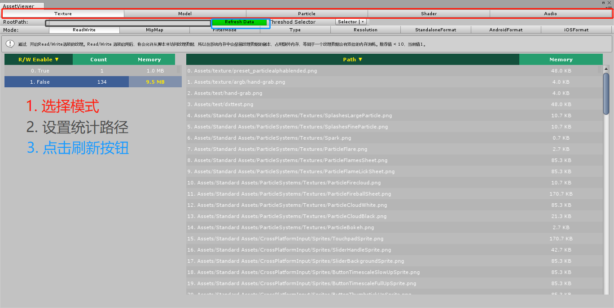

# AssetViewer

## 1. 简介
**AssetViewer**是一款可用于Unity的资源视图插件，统计了项目工程内 **Texture**、**Model**、**Particle**、**Shader**和**Audio** 的相关信息。

## 2. 使用方法
1. 双击安装 **AssetViewer.unitypackage** 即可将插件导入到工程
2. 点击 **Windows->AssetViewer** 或使用快捷键 **Ctrl + X** 启用插件



## 3. 统计内容

1. Texture
    - ReadWrite: Read/Write 选项启用后，将会允许从脚本来访问纹理数据，所以在系统内存中会保留纹理数据的副本，占用额外内存，等同于一个纹理数据会有双倍的内存消耗。
    - MipMap: Mipmap开启后，内存会是未开启 Mipmap 的 1.33 倍，因为 Mipmap 会生成一组长宽依次减少一倍的纹理序列，一直生成到 1*1。 
    - FilterMode: Trilinear 三线性过滤（三线性插值），纹理会在不同的 mip水平之间进行模糊，从而增加 GPU 开销。
    - Type: Unity 支持使用的图片类型包括，Default、Image、NormalMap、Bump、GUI、Cubemap、Reflection、Cookie、Advanced、Lightmap、Cursor、Sprite、HDRI、SingleChannel，详情参考TextureImporterType。Trilinear 三线性过滤（三线性插值），纹理会在不同的 mip水平之间进行模糊，从而增加 GPU 开销。
    - Resolution: 一般来说，纹理尺寸越大，占用的内存也就越大，一般情况我们推荐纹理尺寸为 512*512，如果 512*512 显示效果已经够用，那么就不要用 1024*1024 的纹理，因为后者的内存占用是前者的 4 倍。
    - StandaloneFormat: 纹理在standalone模式下的内存占用。占用的内存过大可能会导致程序崩溃，请根据平台选择适当的压缩格式，Standalone模式下pot不透明纹理推荐使用DXT1，透明纹理推荐使用DXT5，nopt可以考虑将图片打包再使用对应压缩方式。
    - AndroidFormat: 纹理在Android模式下的内存占用。占用的内存过大可能会导致程序崩溃，请根据平台选择适当的压缩格式，Android模式下pot不透明纹理推荐使用ETC1，透明纹理推荐使用ETC2，nopt可以考虑将图片打包再使用对应压缩方式。
    - iOSFormat: 纹理在iOS模式下的内存占用。占用的内存过大可能会导致程序崩溃，请根据平台选择适当的压缩格式，iOS模式下推荐使用ASTC格式。
2. Model
   - ReadWrite: Read/Write 选项启用后，将会允许从脚本来访问网格数据，同时会产生网格数据的副本，占用额外内存，等同于一个网格数据会有接近2倍的内存消耗。
   - TriangleCount: 面片数过大的网格。
   - VertexCount: 顶点数的网格。
   - MeshData: 检测到Mesh的UV、UV2、UV3、UV4、COLOR、NORMAL、TANGENT属性，如无必要建议不进行导入。
   - OptimizeMesh: 未开启OptimizeMesh选项的网格。与模型相关，开启后，Unity 会对其进行网格优化，提高 GPU 效率。
   - ImportMaterial: 导入的材质。
   - MeshCompress: 网格的压缩模式。
3. Particle
   - MaxParticle: 粒子数上限超过指定数目的粒子系统。
   - Duration: 粒子的生存周期。
   - PlayOnAwake: 启动时播放。
   - Looping: 循环。
4. Shader
   - Sample: 纹理采样数过多的Shader。纹理数量大于3，可能导致 GPU 不必要的开销。
   - Pass: Shader的Pass数量。频繁调用setpasscall会切换上下文信息，影响Unity的动态和批。
   - Instruction: HLSL下汇编的指令数。指令数大于20的Shader，会消耗GPU的计算能力。
   - RenderType: Shader的渲染类型。Opaque可能会增加overdraw。
   - Variant: Shader的变体数量。变体数量大于5的Shader，变体会占用大量内存。
   - RenderQueue: Shader渲染队列。BackGroud、Geometry、AlphaTest、Geometry、Transparent、Overlay。
   - MaxLOD: lod
   - Property: Shader的输入参数。
   - SubShader: Define one or more subshader: the first compatiable one with graphic card in internal use will be run.
5. Audio
   - Size: 音频的文件占用压缩前和压缩后磁盘的大小。
   - Mono: Force to Mono。
   - LoadInBackground: 多线程加载。
   - Ambisonic: 是否是环境音。
   - AndroidLoadType: Android平台下的加载方式。
   - iOSLoadType: iOS平台下的加载方式。
   - AndroidCompressionFormat: Android平台下的压缩方式。
   - iOSCompressionFormat: iOS平台下的压缩方式。

## 4. 健康检查
### 4.1 简介
 健康检查通过比较当前项目中的资源信息和预设的相关阈值得出健康状态，分别为 通过、警告和未通过。健康信息将显示在工具栏下方。
 - 通过: 当前项目的资源 < 设定阈值的80%。
 - 警告: 设定阈值的80% <= 当前项目的资源大于设定阈值 <= 设定阈值的100%。
 - 未通过: 当前项目的资源大于设定阈值 》 设定阈值的100%。

 ### 4.2 使用方式
 在工具栏中 **Threshod Selector** 点击 **Selector** 即可选择对应的阈值。

 ### 4.3 阈值配置方式
 > 预设阈值存放路径为 **Assets\Editor\AssetViewer\Config**，如 **Health-Config**，文件描述采用json方式。  
 
 配置模板
 ``` json
{
    "Name" : "Default",
    "WinTypeConfig" : [
        {
            "WinTypeName": "Texture",
            "ModeConfig" : [
                {
                    "ModeName" : "ReadWrite",
                    "Enable" : true,
                    "Tip" : "开启Read/Write选项的纹理。Read/Write 选项启用后，将会允许从脚本来访问纹理数据，所以在系统内存中会保留纹理数据的副本，占用额外内存，等同于一个纹理数据会有双倍的内存消耗。",
                    "ConfigValue" : 10,
                    "Condition" : [true]
                }
            ]
        }
    ]
}
 ```


